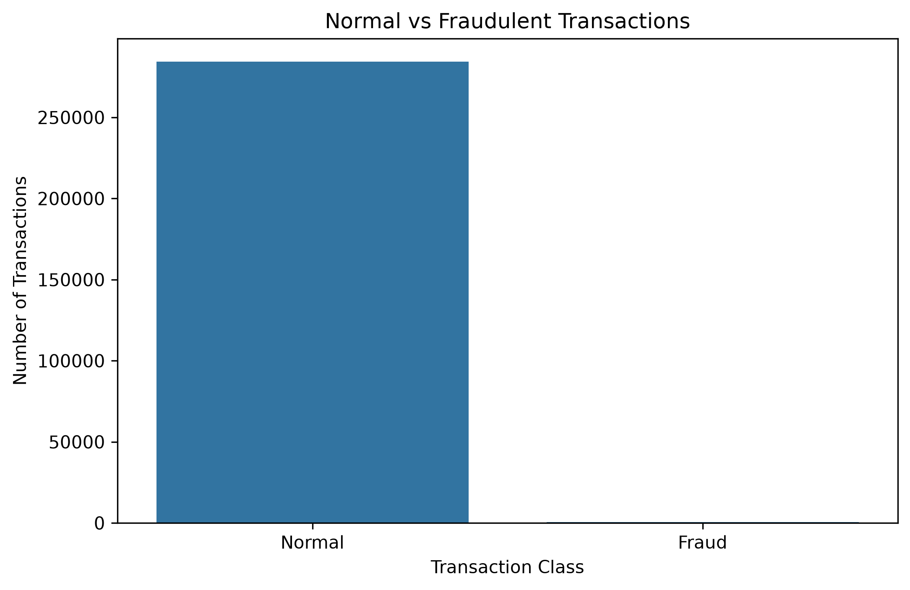
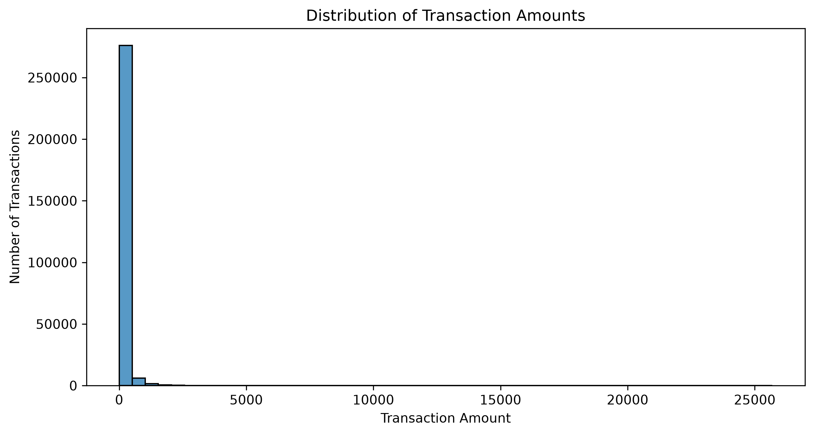
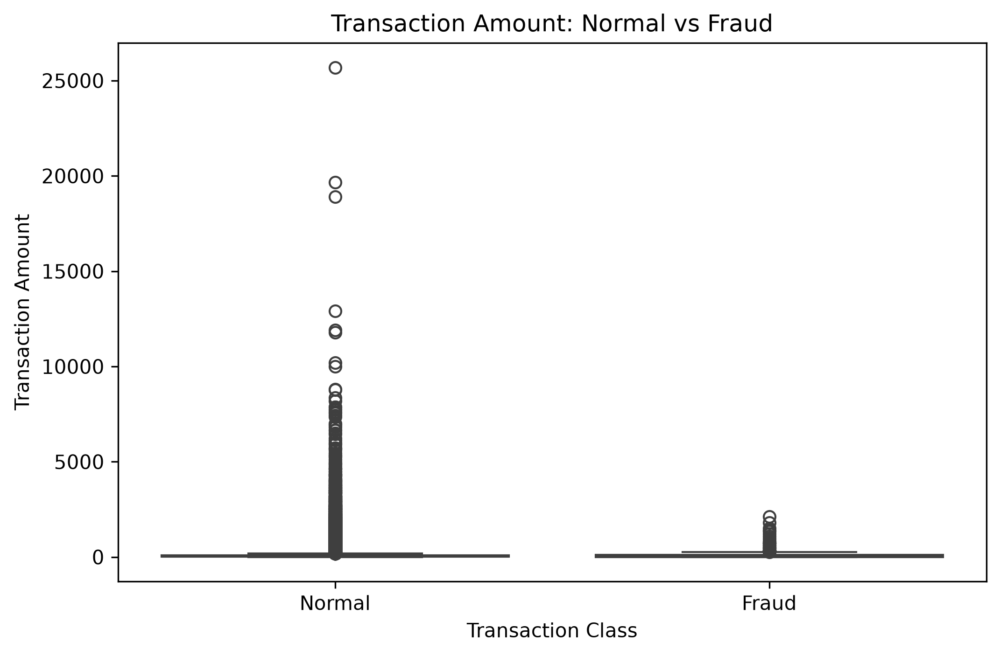
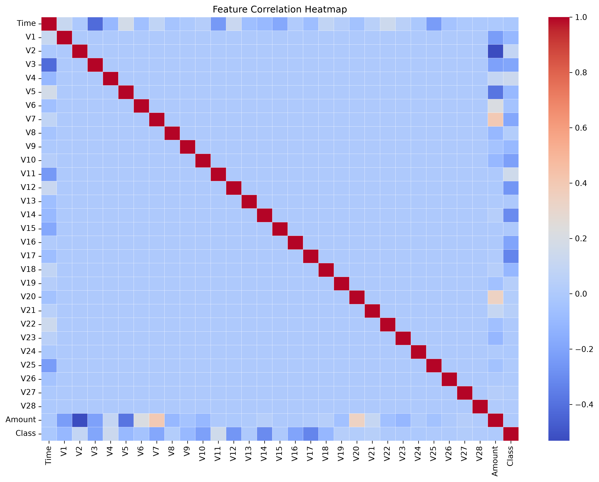
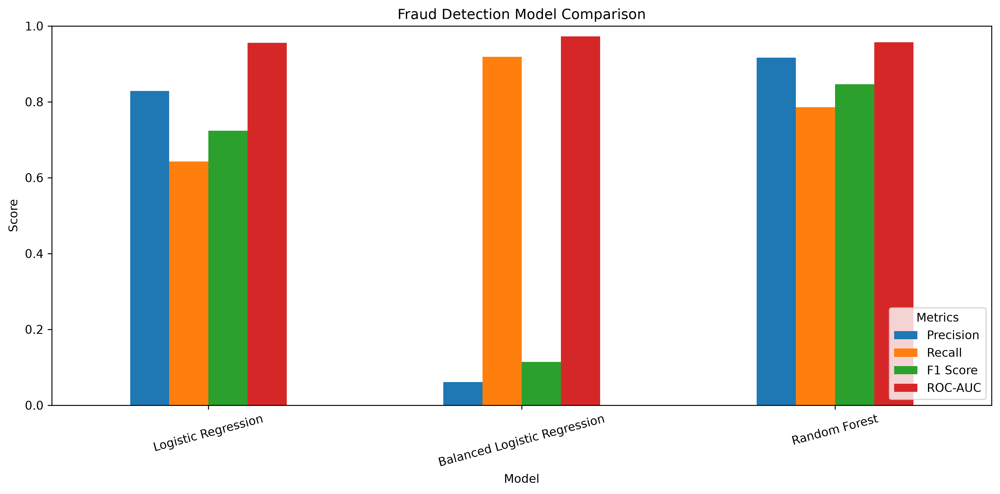
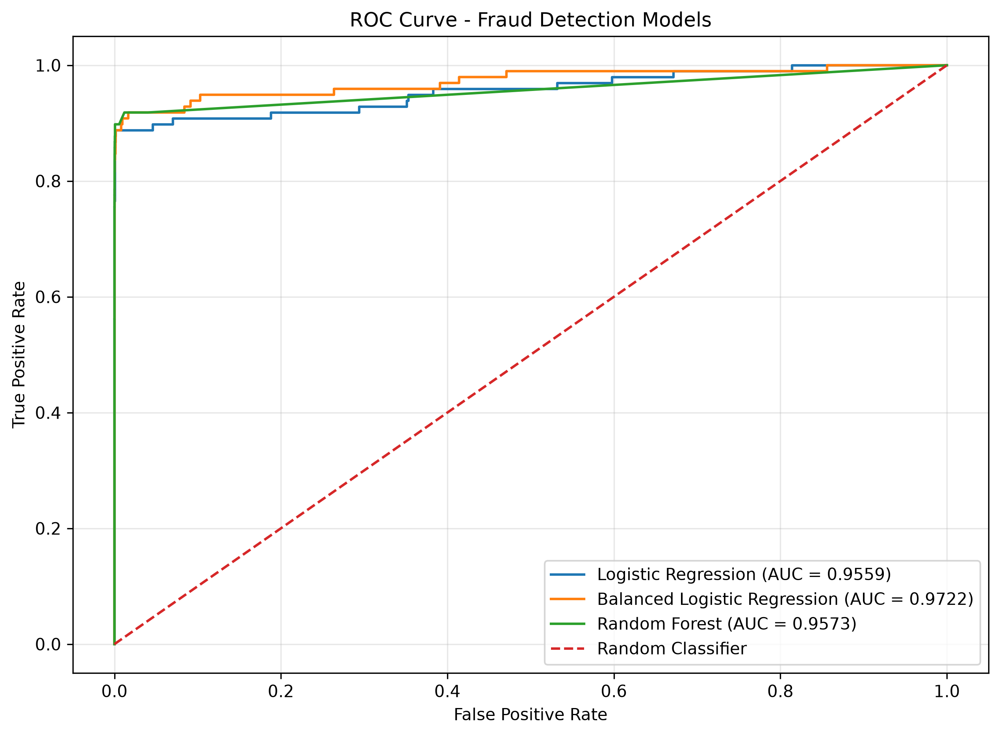
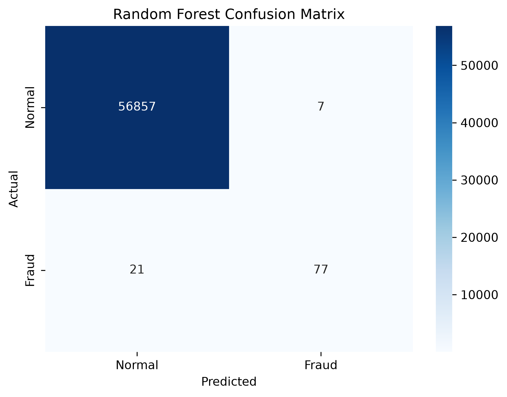
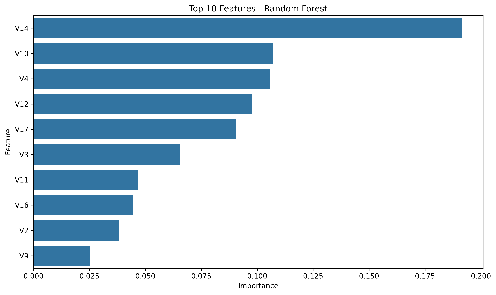

# Credit Card Fraud Detection

A machine learning project for detecting fraudulent credit card transactions using Python and Scikit-learn.

## Project Overview

Credit card fraud detection is a highly imbalanced binary classification problem because fraudulent transactions represent only a very small percentage of all transactions.

This project explores the dataset, analyzes transaction patterns, trains multiple machine learning models, and evaluates their ability to detect fraudulent transactions.

## Dataset

The dataset contains:

- 284,807 transactions
- 30 input features
- 1 target variable (`Class`)
- No missing values

The target variable is:

- `0` — Normal transaction
- `1` — Fraudulent transaction

The dataset contains only 492 fraudulent transactions, representing approximately 0.173% of all transactions.

> The dataset is not included in this repository because of its size.
> Place the downloaded `creditcard.csv` file inside the `Data/` folder before running the project.

## Technologies Used

- Python
- Pandas
- NumPy
- Matplotlib
- Seaborn
- Scikit-learn

## Machine Learning Models

Three classification approaches were evaluated:

1. Logistic Regression
2. Balanced Logistic Regression
3. Random Forest

The balanced Logistic Regression model uses `class_weight="balanced"` to give greater importance to the minority fraud class.

## Data Preprocessing

The following preprocessing steps were performed:

- Loaded the transaction dataset using Pandas
- Separated features and target variable
- Split the dataset into training and testing sets
- Used stratified sampling to preserve the fraud ratio
- Standardized the `Time` and `Amount` features
- Fitted the scaler only on the training data to avoid data leakage

## Model Evaluation

Because the dataset is highly imbalanced, accuracy alone is not sufficient for evaluating the models.

The following metrics were used:

- Precision
- Recall
- F1-score
- ROC-AUC
- Confusion Matrix

### Model Comparison

| Model | Precision | Recall | F1-score | ROC-AUC |
|---|---:|---:|---:|---:|
| Logistic Regression | 82.9% | 64.3% | 72.4% | 95.6% |
| Balanced Logistic Regression | 6.1% | 91.8% | 11.4% | 97.2% |
| Random Forest | **91.7%** | **78.6%** | **84.6%** | 95.7% |

## Best Model

Random Forest provided the best balance between precision and recall.

On the test set, the Random Forest model achieved:

- Precision: **91.7%**
- Recall: **78.6%**
- F1-score: **84.6%**
- ROC-AUC: **95.7%**

The model correctly detected **77 out of 98 fraudulent transactions** while incorrectly classifying only **7 normal transactions as fraudulent**.

## Visualizations

### Class Distribution



### Transaction Amount Distribution



### Fraud vs Normal Transaction Amount



### Correlation Heatmap



### Model Comparison



### ROC Curve



### Random Forest Confusion Matrix



### Feature Importance



## Key Findings

- Fraudulent transactions represent only approximately 0.173% of the dataset.
- The severe class imbalance makes accuracy an unreliable standalone metric.
- Balanced Logistic Regression achieved the highest fraud recall but generated many false positives.
- Random Forest provided a better precision-recall trade-off.
- Random Forest achieved 91.7% precision and 78.6% recall for fraudulent transactions.
- Features such as V12, V17, V3, V11, and V16 were among the most important features according to the Random Forest model.

## Project Structure

```text
Credit Card Fraud Detection/
│
├── Data/
│   └── creditcard.csv
│
├── graphs/
│   ├── class_distribution.png
│   ├── confusion_matrix.png
│   ├── correlation_heatmap.png
│   ├── feature_importance.png
│   ├── fraud_vs_normal_amount.png
│   ├── model_comparison.png
│   ├── random_forest_confusion_matrix.png
│   ├── roc_curve_comparison.png
│   └── transaction_amount_distribution.png
│
├── src/
│   ├── fraud_detection.py
│   └── model.py
│
├── .gitignore
├── README.md
└── requirements.txt