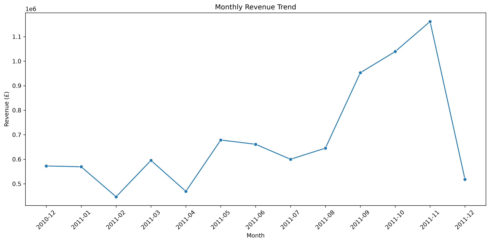
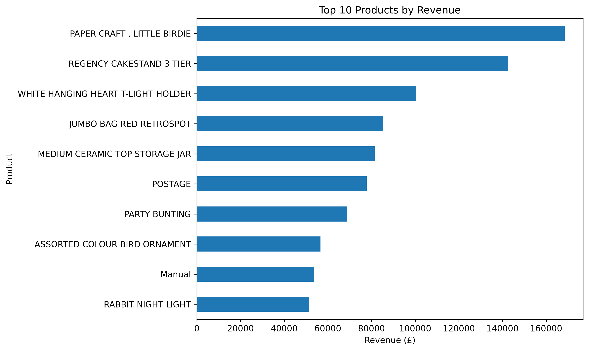
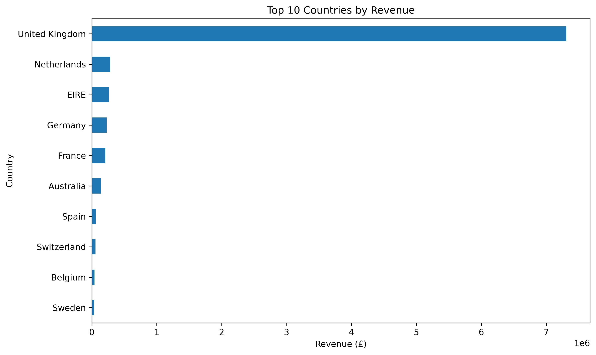
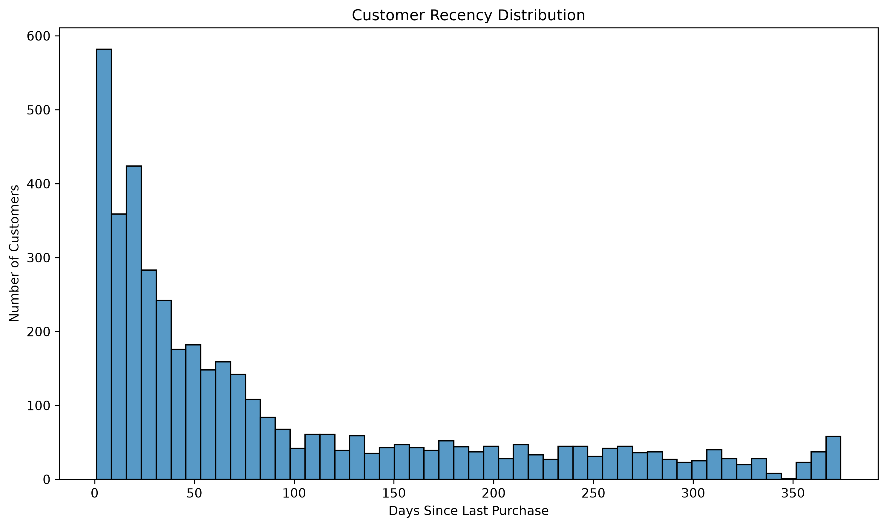
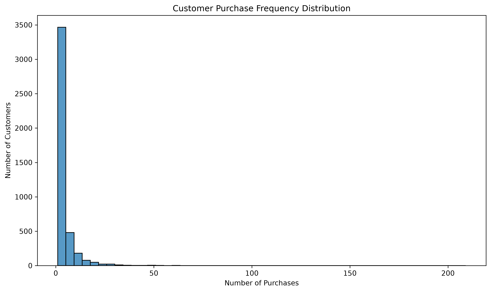
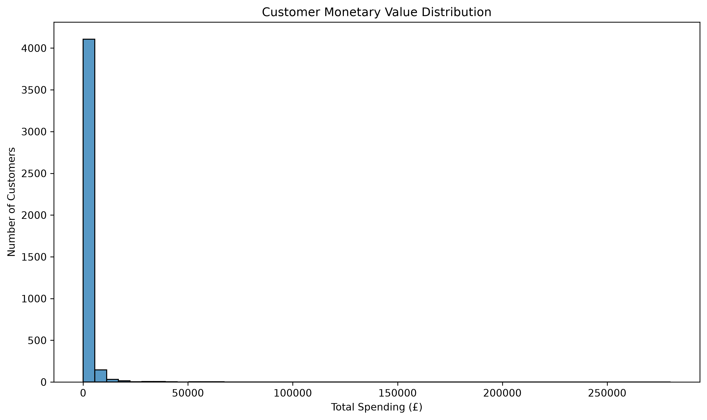
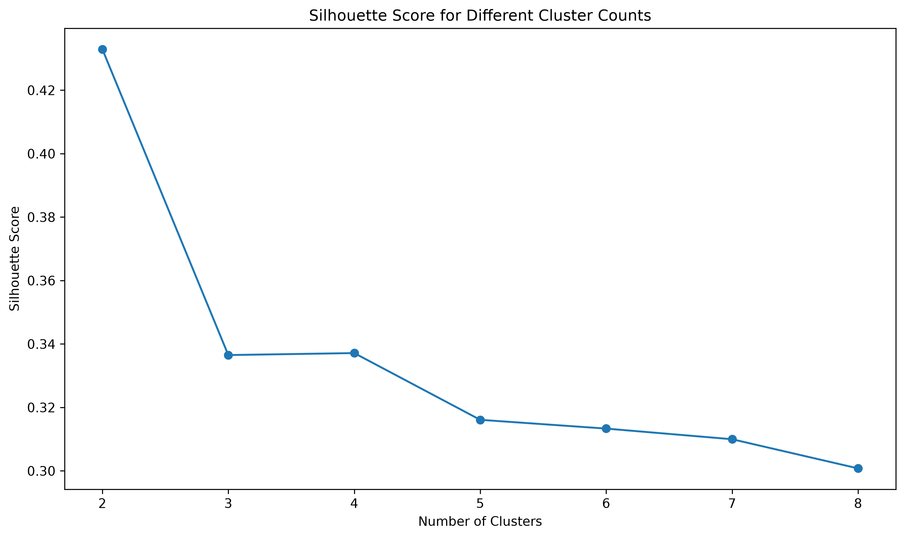
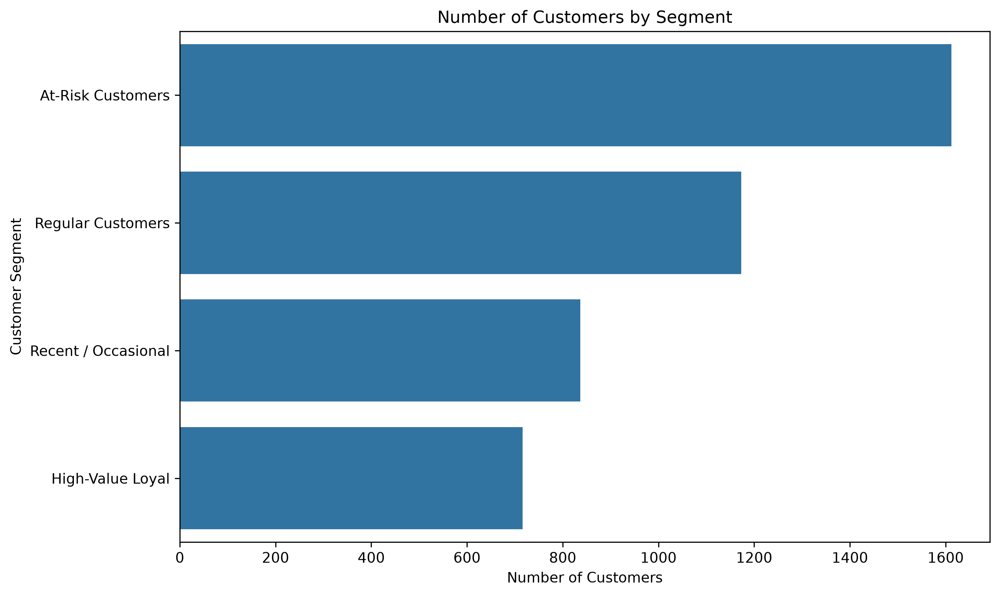
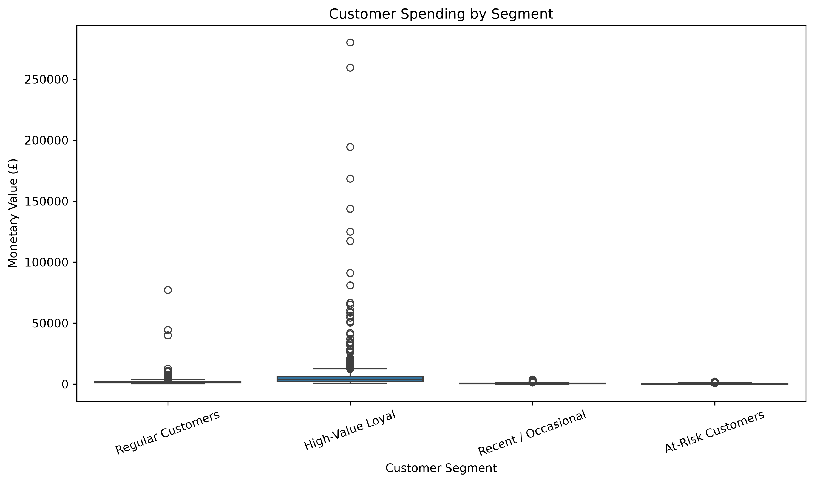
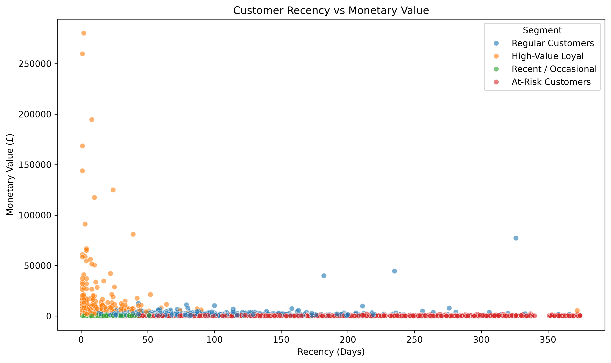

# Online Retail Customer Segmentation

A data analysis and machine learning project that analyzes online retail transactions and segments customers based on their purchasing behavior using RFM analysis and K-Means clustering.

## Project Overview

This project analyzes an online retail dataset containing over 500,000 transactions.

The analysis focuses on:

- Data cleaning and preprocessing
- Sales and revenue analysis
- Monthly revenue trends
- Top products by revenue
- Country-wise revenue analysis
- Customer purchasing behavior
- RFM (Recency, Frequency, Monetary) analysis
- Customer segmentation using K-Means clustering

The goal is to identify meaningful customer groups that can help businesses understand purchasing behavior and develop targeted marketing strategies.

## Dataset

The original dataset contains:

- 541,909 transactions
- 8 columns
- 37 countries

The main columns include:

- `InvoiceNo` — Transaction/invoice number
- `StockCode` — Product code
- `Description` — Product description
- `Quantity` — Number of items purchased
- `InvoiceDate` — Transaction date and time
- `UnitPrice` — Price per item
- `CustomerID` — Unique customer identifier
- `Country` — Customer's country

The dataset contains missing Customer IDs and cancelled transactions, which are handled during preprocessing.

## Data Cleaning

The following preprocessing steps were performed:

- Converted `InvoiceDate` to datetime format
- Removed cancelled transactions
- Removed transactions with negative quantities
- Removed transactions with invalid prices
- Removed records without a `CustomerID`
- Converted `CustomerID` to integer
- Created a `Revenue` column

Revenue was calculated as:

`Revenue = Quantity × UnitPrice`

After cleaning:

- 397,884 valid transactions remained
- 4,338 unique customers remained
- Total revenue was £8,911,407.90
- No missing values remained in the cleaned dataset

## Sales Analysis

### Monthly Revenue

The analysis identified monthly revenue trends across the dataset.

The highest monthly revenue occurred in:

**November 2011 — £1,161,817.38**



### Top Products

The highest-revenue product was:

**PAPER CRAFT, LITTLE BIRDIE — £168,469.60**



### Top Countries

Revenue was also analyzed across the 37 countries represented in the dataset.



## RFM Analysis

RFM analysis was used to measure customer purchasing behavior.

### Recency

Measures how recently a customer made a purchase.

### Frequency

Measures how many unique invoices a customer has made.

### Monetary

Measures the total amount spent by a customer.

The RFM dataset contains:

**4,338 customers**

Average values:

| Metric | Average |
|---|---:|
| Recency | 92.54 days |
| Frequency | 4.27 purchases |
| Monetary | £2,054.27 |

### RFM Distributions







## Customer Segmentation

K-Means clustering was applied to the RFM features.

Before clustering:

1. RFM features were log-transformed using `log1p`
2. Features were standardized using `StandardScaler`
3. K-Means clustering was applied

Silhouette scores were calculated for cluster counts from 2 to 8.



Although 2 clusters produced the highest silhouette score, 4 clusters were selected to provide more actionable business-oriented customer segments.

## Customer Segments

The final customer segments were:

| Segment | Customers | Avg. Recency | Avg. Frequency | Avg. Monetary |
|---|---:|---:|---:|---:|
| High-Value Loyal | 716 | 12.13 days | 13.71 | £8,074.27 |
| Recent / Occasional | 837 | 18.12 days | 2.15 | £551.82 |
| Regular Customers | 1,173 | 71.08 days | 4.08 | £1,802.83 |
| At-Risk Customers | 1,612 | 182.50 days | 1.32 | £343.45 |



### High-Value Loyal

These customers purchase frequently, purchased recently, and have significantly higher spending.

Potential strategy:

- VIP rewards
- Exclusive offers
- Loyalty programs
- Personalized recommendations

### Recent / Occasional

These customers have purchased recently but have relatively low purchase frequency.

Potential strategy:

- Personalized promotions
- Product recommendations
- Loyalty incentives

### Regular Customers

These customers demonstrate moderate purchasing activity and spending.

Potential strategy:

- Cross-selling
- Upselling
- Loyalty rewards

### At-Risk Customers

This is the largest customer segment.

These customers have not purchased recently and have relatively low purchase frequency and spending.

Potential strategy:

- Win-back campaigns
- Discount offers
- Personalized email campaigns
- Re-engagement promotions

## Additional Visualizations

### Customer Spending by Segment



### Recency vs Monetary Value



## Key Findings

- The dataset contained 541,909 original transactions.
- 397,884 valid transactions remained after cleaning.
- Total revenue was approximately £8.91 million.
- The dataset contains 4,338 identifiable customers.
- November 2011 generated the highest monthly revenue.
- Customer purchasing behavior varies significantly across segments.
- High-Value Loyal customers generated substantially higher average spending.
- At-Risk customers represented the largest segment with 1,612 customers.
- RFM analysis combined with K-Means clustering provides actionable customer segments.
- The 4-segment solution was selected for business interpretability despite the higher silhouette score obtained with 2 clusters.

## Technologies Used

- Python
- Pandas
- NumPy
- Matplotlib
- Seaborn
- Scikit-learn

## Project Structure

```text
Online Retail Customer Segmentation/
│
├── Data/
│   └── online_retail.csv
│
├── graphs/
│   ├── customer_segments.png
│   ├── customer_spending_by_segment.png
│   ├── frequency_distribution.png
│   ├── monetary_distribution.png
│   ├── monthly_revenue.png
│   ├── recency_distribution.png
│   ├── recency_vs_monetary.png
│   ├── silhouette_scores.png
│   ├── top_10_countries.png
│   └── top_10_products.png
│
├── src/
│   ├── customer_segmentation.py
│   └── retail_analysis.py
│
├── .gitignore
├── README.md
└── requirements.txt