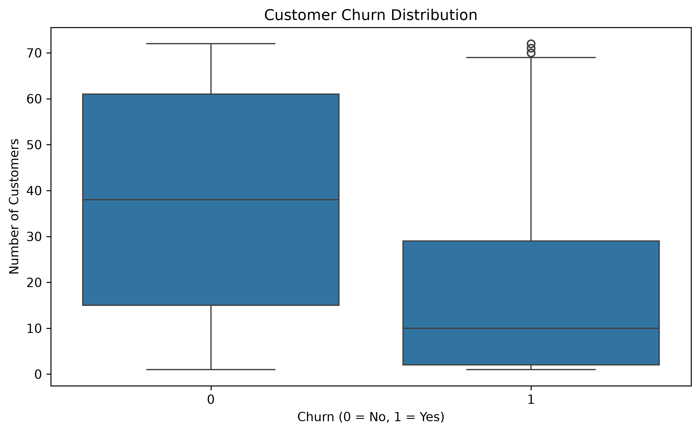

# Telco Customer Churn Prediction

## Project Overview

Customer churn is a major challenge for telecom companies because losing existing customers can significantly impact revenue.

This project uses Python and machine learning to predict whether a telecom customer is likely to churn based on their demographics, services, contract type, tenure, and billing information.

The project follows an end-to-end machine learning workflow, from data cleaning and exploratory data analysis to model training, evaluation, and churn prediction.

---

## Objectives

- Analyze customer churn patterns
- Identify factors associated with customer churn
- Preprocess categorical and numerical data
- Build machine learning classification models
- Compare Logistic Regression and Random Forest
- Evaluate models using multiple performance metrics
- Identify customers who are at higher risk of churn

---

## Dataset

The dataset contains information about **7,043 telecom customers** and includes:

- Customer demographics
- Contract information
- Internet and phone services
- Payment methods
- Monthly charges
- Total charges
- Customer tenure
- Churn status

After data cleaning, **7,032 records** were used for modeling.

---

## Technologies Used

- Python
- Pandas
- NumPy
- Matplotlib
- Seaborn
- Scikit-learn
- Machine Learning
- Data Visualization

---

## Project Workflow

### 1. Data Loading

Loaded the Telco Customer Churn dataset using Pandas.

### 2. Data Cleaning

- Converted `TotalCharges` from text to numeric
- Handled missing values
- Converted the target variable `Churn` into binary values
- Removed `customerID` from the machine learning features

### 3. Exploratory Data Analysis

Analyzed:

- Overall churn distribution
- Churn by contract type
- Customer tenure
- Monthly charges
- Customer behavior patterns

### 4. Data Preprocessing

- Numerical features were standardized using `StandardScaler`
- Categorical features were encoded using `OneHotEncoder`
- Training and testing data were separated using an 80/20 split

### 5. Machine Learning Models

Two classification models were trained:

- Logistic Regression
- Random Forest Classifier

### 6. Model Evaluation

Models were evaluated using:

- Accuracy
- Precision
- Recall
- F1 Score
- ROC-AUC
- Confusion Matrix
- ROC Curve

---

## Model Performance

| Model | Accuracy | Precision | Recall | F1 Score | ROC-AUC |
|---|---:|---:|---:|---:|---:|
| Logistic Regression | 72.57% | 49.01% | 79.68% | 60.69% | **0.8351** |
| Random Forest | **76.05%** | **54.20%** | 63.90% | 58.65% | 0.8147 |

### Selected Model

**Logistic Regression**

The Logistic Regression model achieved the highest ROC-AUC score of **0.8351** and a churn recall of **79.68%**.

High recall is valuable in this project because identifying customers who are likely to churn can help a telecom company take proactive retention actions.

---

## Key Business Insight

Contract type shows a strong relationship with customer churn.

Customers with **month-to-month contracts** have a substantially higher churn rate compared with customers on one-year or two-year contracts.

This suggests that telecom companies could focus retention strategies on month-to-month customers, such as:

- Contract upgrade incentives
- Personalized offers
- Customer loyalty programs
- Proactive customer support

---

## Project Visualizations

### Customer Churn Distribution


### Churn Rate by Contract



### Tenure vs Churn


### Monthly Charges vs Churn


### Confusion Matrix


### ROC Curve


### Feature Importance


---

## Project Structure

```text
Telco-Customer-Churn-Prediction/
│
├── Data/
│   └── telco_customer_churn.csv
│
├── graphs/
│   ├── churn_by_contract.png
│   ├── churn_distribution.png
│   ├── confusion_matrix.png
│   ├── feature_importance.png
│   ├── monthly_charges_vs_churn.png
│   ├── roc_curve.png
│   └── tenure_vs_churn.png
│
├── src/
│   └── churn_prediction.py
│
├── .gitignore
├── README.md
└── requirements.txt